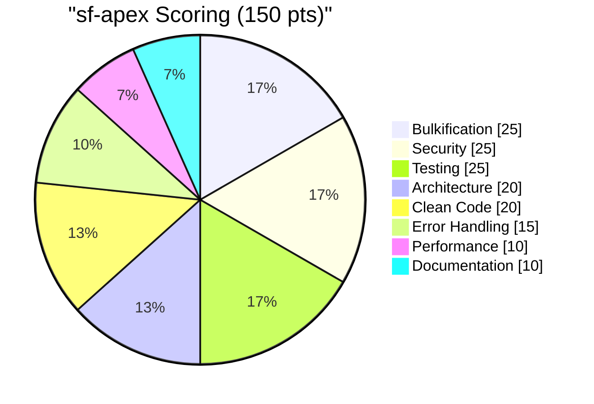

# Salesforce Skills for Agentic Coding Tools

[](https://opensource.org/licenses/MIT)
[](https://claude.ai/code)
[](https://www.salesforce.com/)

A collection of reusable skills for Salesforce development, specializing in Apex code generation, Flow automation, Metadata management, and DevOps workflows. Built for Claude Code with planned support for other agentic coding tools.

---

## 💡 What is a Skill?

> **Skills are portable knowledge packs that supercharge AI coding agents with domain expertise.**

Think of skills as "installable superpowers" for your agentic coding tool. Instead of repeatedly explaining Salesforce best practices to your AI assistant, a skill pre-loads that knowledge so the AI becomes an instant expert.

```
sf-apex/
├── SKILL.md              # 🧠 The brain - prompts & instructions
├── templates/            # 📁 Code templates & patterns
├── hooks/                # ✅ Validation scripts
└── examples/             # 📖 Usage examples
```

> 💡 **Tip:** Skills are open-source and composable. You can fork, customize, or create your own!

### Why Use Skills?

| Without Skills | With Skills |
|----------------|-------------|
| ❌ Explain best practices every conversation | ✅ AI already knows the standards |
| ❌ Manually review code for anti-patterns | ✅ Auto-validation on every file save |
| ❌ Copy-paste boilerplate repeatedly | ✅ Production-ready templates built-in |
| ❌ Remember CLI commands and flags | ✅ Skill handles tool orchestration |
| ❌ Burn tokens on lengthy system prompts | ✅ Skills load on-demand, saving context |

---

## 🤖 Supported Agentic Coding Tools

| Tool | Status | |
|------|--------|--|
| **Claude Code CLI** | ✅ Full Support |  |
| **Agentforce Vibes CLI** | 🔜 Planned |  |
| **Google Gemini CLI** | 🔜 Planned |  |
| **Droid CLI** | 🔜 Planned |  |
| **Codex CLI** | 🔜 Planned |  |

## ✨ Available Skills

| Skill | Description | Scoring | Status |
|-------|-------------|---------|--------|
| **[sf-apex](sf-apex/)** | Apex code generation & review with TAF pattern enforcement | 150 pts | ✅ Live |
| **[sf-flow](sf-flow/)** | Flow creation & validation with bulkification checks | 110 pts | ✅ Live |
| **[sf-metadata](sf-metadata/)** | Metadata generation & org querying | 120 pts | ✅ Live |
| **[sf-data](sf-data/)** | Data operations, SOQL expertise & test data factories | 130 pts | ✅ Live |
| **[sf-deploy](sf-deploy/)** | DevOps & CI/CD automation using sf CLI v2 | — | ✅ Live |
| **[sf-ai-agentforce](sf-ai-agentforce/)** | Agentforce agent creation with Agent Script syntax | 100 pts | ✅ Live |
| **[sf-connected-apps](sf-connected-apps/)** | Connected Apps & External Client Apps with OAuth config | 120 pts | ✅ Live |
| **[skill-builder](skill-builder/)** | Claude Code skill creation wizard | — | ✅ Live |

## 🚀 Installation

First, add the marketplace to Claude Code:

```bash
/plugin marketplace add Jaganpro/sf-skills
```

### 📺 Video 1: How to Add/Install Skills to ClaudeCode?

<a href="https://youtu.be/a38MM8PBTe4" target="_blank">
  
</a>

## 🔗 Skill Architecture

### Complete Skill Ecosystem

```mermaid
flowchart TB
    subgraph ai["🤖 AI & Agents"]
        agentforce["🤖 sf-ai-agentforce<br/><small>Agent Script, Topics, Actions</small>"]
    end

    subgraph integration["🔌 Integration"]
        connectedapps["🔐 sf-connected-apps<br/><small>OAuth, ECAs, Security</small>"]
    end

    subgraph development["💻 Development"]
        apex["⚡ sf-apex<br/><small>Triggers, Services, Tests</small>"]
        flow["🔄 sf-flow<br/><small>Screen, Record, Scheduled</small>"]
    end

    subgraph foundation["📦 Foundation"]
        metadata["📋 sf-metadata<br/><small>Objects, Fields, Perms</small>"]
        data["💾 sf-data<br/><small>SOQL, CRUD, Test Data</small>"]
    end

    subgraph devops["🚀 DevOps"]
        deploy["🚀 sf-deploy<br/><small>CI/CD, Validation</small>"]
    end

    subgraph tooling["🔧 Tooling"]
        skillbuilder["🛠️ skill-builder<br/><small>Create New Skills</small>"]
    end

    %% AI relationships
    agentforce -->|"flow:// targets"| flow
    agentforce -.->|"Apex via Flow Wrapper"| apex

    %% Integration relationships
    connectedapps -->|"Named Credentials"| metadata
    connectedapps -->|"deploys"| deploy

    %% Development relationships
    apex -->|"queries schema"| metadata
    flow -->|"queries schema"| metadata
    apex -.->|"test data"| data
    flow -.->|"test data"| data

    %% Foundation relationships
    data -->|"queries structure"| metadata

    %% Deployment relationships
    apex -->|"deploys"| deploy
    flow -->|"deploys"| deploy
    metadata -->|"deploys"| deploy
    agentforce -->|"publishes"| deploy

    %% Styling
    style agentforce fill:#ec4899,stroke:#db2777,color:#fff
    style connectedapps fill:#f97316,stroke:#ea580c,color:#fff
    style apex fill:#8b5cf6,stroke:#7c3aed,color:#fff
    style flow fill:#6366f1,stroke:#4f46e5,color:#fff
    style metadata fill:#06b6d4,stroke:#0891b2,color:#fff
    style data fill:#f59e0b,stroke:#d97706,color:#fff
    style deploy fill:#10b981,stroke:#059669,color:#fff
    style skillbuilder fill:#64748b,stroke:#475569,color:#fff

    style ai fill:#fdf2f8,stroke:#ec4899,stroke-width:2px
    style integration fill:#fff7ed,stroke:#f97316,stroke-width:2px
    style development fill:#f5f3ff,stroke:#8b5cf6,stroke-width:2px
    style foundation fill:#ecfeff,stroke:#06b6d4,stroke-width:2px
    style devops fill:#ecfdf5,stroke:#10b981,stroke-width:2px
    style tooling fill:#f8fafc,stroke:#64748b,stroke-width:2px
```



### Skill Dependency Flow

```mermaid
flowchart LR
    subgraph inputs["📥 Inputs"]
        requirements["Requirements"]
        existing["Existing Code"]
    end

    subgraph skills["🧠 Skills Process"]
        direction TB
        gather["1️⃣ Gather Info<br/><small>AskUserQuestion</small>"]
        query["2️⃣ Query Schema<br/><small>sf-metadata</small>"]
        generate["3️⃣ Generate<br/><small>Templates + Logic</small>"]
        validate["4️⃣ Validate<br/><small>Scoring System</small>"]
        deploy_step["5️⃣ Deploy<br/><small>sf-deploy</small>"]
    end

    subgraph outputs["📤 Outputs"]
        code["Apex/Flow/Metadata"]
        report["Validation Report"]
        deployed["Deployed to Org"]
    end

    requirements --> gather
    existing --> gather
    gather --> query
    query --> generate
    generate --> validate
    validate --> deploy_step

    generate --> code
    validate --> report
    deploy_step --> deployed

    style gather fill:#6366f1,stroke:#4f46e5,color:#fff
    style query fill:#06b6d4,stroke:#0891b2,color:#fff
    style generate fill:#8b5cf6,stroke:#7c3aed,color:#fff
    style validate fill:#f59e0b,stroke:#d97706,color:#fff
    style deploy_step fill:#10b981,stroke:#059669,color:#fff

    style inputs fill:#f1f5f9,stroke:#64748b
    style skills fill:#faf5ff,stroke:#8b5cf6
    style outputs fill:#ecfdf5,stroke:#10b981
```



### Connected Apps & External Client Apps Flow

```mermaid
flowchart TB
    subgraph request["📝 Request"]
        user["User Request"]
    end

    subgraph decision["🤔 Decision"]
        apptype{{"App Type?"}}
    end

    subgraph connectedapp["🔗 Connected App Path"]
        ca_template["Select Template<br/><small>basic, oauth, jwt, canvas</small>"]
        ca_generate["Generate XML<br/><small>.connectedApp-meta.xml</small>"]
    end

    subgraph eca["🔐 External Client App Path"]
        eca_header["Generate Header<br/><small>.eca-meta.xml</small>"]
        eca_oauth["Generate OAuth<br/><small>.ecaGlobalOauth-meta.xml<br/>.ecaOauth-meta.xml</small>"]
        eca_policy["Generate Policies<br/><small>.ecaPolicy-meta.xml</small>"]
    end

    subgraph validation["✅ Validation"]
        score["Score: 120 pts<br/><small>Security, OAuth, Compliance</small>"]
    end

    subgraph deployment["🚀 Deployment"]
        deploy_ca["Deploy to Org"]
        deploy_eca["Deploy to DevHub"]
    end

    user --> apptype
    apptype -->|"Simple/Single Org"| ca_template
    apptype -->|"Multi-Org/ISV/Modern"| eca_header

    ca_template --> ca_generate
    ca_generate --> score

    eca_header --> eca_oauth
    eca_oauth --> eca_policy
    eca_policy --> score

    score -->|"Connected App"| deploy_ca
    score -->|"External Client App"| deploy_eca

    style apptype fill:#f59e0b,stroke:#d97706,color:#fff
    style ca_template fill:#6366f1,stroke:#4f46e5,color:#fff
    style ca_generate fill:#6366f1,stroke:#4f46e5,color:#fff
    style eca_header fill:#f97316,stroke:#ea580c,color:#fff
    style eca_oauth fill:#f97316,stroke:#ea580c,color:#fff
    style eca_policy fill:#f97316,stroke:#ea580c,color:#fff
    style score fill:#10b981,stroke:#059669,color:#fff
    style deploy_ca fill:#8b5cf6,stroke:#7c3aed,color:#fff
    style deploy_eca fill:#8b5cf6,stroke:#7c3aed,color:#fff

    style request fill:#f1f5f9,stroke:#64748b
    style decision fill:#fef3c7,stroke:#f59e0b
    style connectedapp fill:#eef2ff,stroke:#6366f1
    style eca fill:#fff7ed,stroke:#f97316
    style validation fill:#ecfdf5,stroke:#10b981
    style deployment fill:#f5f3ff,stroke:#8b5cf6
```



### Agentforce Integration Architecture

```mermaid
flowchart TB
    subgraph agentscript["📝 Agent Script"]
        agent["Agent Definition<br/><small>.agent file</small>"]
        topics["Topics<br/><small>Intents & Actions</small>"]
    end

    subgraph targets["🎯 Action Targets"]
        flowaction["flow://<br/><small>Autolaunched Flows</small>"]
        flowwrapper["Flow Wrapper<br/><small>For Apex</small>"]
    end

    subgraph apex_layer["⚡ Apex Layer"]
        invocable["@InvocableMethod<br/><small>Apex Class</small>"]
    end

    subgraph flow_layer["🔄 Flow Layer"]
        autoflow["Autolaunched Flow<br/><small>actionCalls</small>"]
    end

    subgraph deployment_layer["🚀 Deployment"]
        publish["sf agent publish<br/><small>authoring-bundle</small>"]
    end

    agent --> topics
    topics -->|"Direct"| flowaction
    topics -->|"Via Wrapper"| flowwrapper

    flowaction --> autoflow
    flowwrapper --> autoflow
    autoflow -->|"actionType=apex"| invocable

    agent --> publish
    autoflow --> publish
    invocable --> publish

    style agent fill:#ec4899,stroke:#db2777,color:#fff
    style topics fill:#ec4899,stroke:#db2777,color:#fff
    style flowaction fill:#6366f1,stroke:#4f46e5,color:#fff
    style flowwrapper fill:#6366f1,stroke:#4f46e5,color:#fff
    style autoflow fill:#6366f1,stroke:#4f46e5,color:#fff
    style invocable fill:#8b5cf6,stroke:#7c3aed,color:#fff
    style publish fill:#10b981,stroke:#059669,color:#fff

    style agentscript fill:#fdf2f8,stroke:#ec4899
    style targets fill:#eef2ff,stroke:#6366f1
    style apex_layer fill:#f5f3ff,stroke:#8b5cf6
    style flow_layer fill:#eef2ff,stroke:#6366f1
    style deployment_layer fill:#ecfdf5,stroke:#10b981
```



## 🔌 Plugin Features

### Automatic Validation Hooks

Each skill includes validation hooks that run automatically when you write files:

| Skill | File Type | Validation |
|-------|-----------|------------|
| sf-apex | `*.cls`, `*.trigger` | Apex anti-patterns, 150-point scoring, TAF compliance |
| sf-flow | `*.flow-meta.xml` | Flow best practices, 110-point scoring, bulk safety |
| sf-metadata | `*.object-meta.xml`, `*.field-meta.xml`, etc. | Metadata best practices, 120-point scoring, FLS checks |
| sf-data | `*.apex`, `*.soql` | SOQL patterns, 130-point scoring, governor limits |
| sf-ai-agentforce | `*.agent` | Agent Script syntax, 100-point scoring, topic validation |
| sf-connected-apps | `*.connectedApp-meta.xml`, `*.eca-meta.xml` | OAuth security, 120-point scoring, PKCE validation |
| skill-builder | `SKILL.md` | YAML frontmatter validation |

Hooks provide **advisory feedback** after writes - they inform but don't block.

### Scoring System Overview



## 🔧 Prerequisites

- **Claude Code** (latest version)
- **Salesforce CLI** v2.x (`sf` command, not legacy `sfdx`)
- **Python 3.8+** (optional, for validation hooks)

## Usage Examples

### Apex Development
```
"Generate an Apex trigger for Account using Trigger Actions Framework"
"Review my AccountService class for best practices"
"Create a batch job to process millions of records"
"Generate a test class with 90%+ coverage"
```

### Flow Development
```
"Create a screen flow for account creation with validation"
"Build a record-triggered flow for opportunity stage changes"
"Generate a scheduled flow for data cleanup"
```

### Metadata Management
```
"Create a custom object called Invoice with auto-number name field"
"Add a lookup field from Contact to Account"
"Generate a permission set for invoice managers with full CRUD"
"Create a validation rule to require close date when status is Closed"
"Describe the Account object in my org and list all custom fields"
```

### Data Operations
```
"Query all Accounts with related Contacts and Opportunities"
"Create 251 test Account records for trigger bulk testing"
"Insert 500 records from accounts.csv using Bulk API"
"Generate test data hierarchy: 10 Accounts with 3 Contacts each"
"Clean up all test records created today"
```

### Connected Apps & OAuth
```
"Create a Connected App for API integration with JWT Bearer flow"
"Generate an External Client App for our mobile application with PKCE"
"Review my Connected Apps for security best practices"
"Migrate MyConnectedApp to an External Client App"
```

### Agentforce Agents
```
"Create an Agentforce agent for customer support triage"
"Build a FAQ agent with topic-based routing"
"Generate an agent that calls my Apex service via Flow wrapper"
```

### Deployment
```
"Deploy my Apex classes to sandbox with tests"
"Validate my metadata changes before deploying to production"
```

### Skill Creation
```
"Create a new Claude Code skill for code analysis"
```

## Roadmap

### Naming Convention
```
sf-{capability}           # Cross-cutting (apex, flow, admin)
sf-ai-{name}              # AI features (agentforce, copilot)
sf-product-{name}         # Products (datacloud, omnistudio)
sf-cloud-{name}           # Clouds (sales, service)
sf-industry-{name}        # Industries (healthcare, finserv)
```

### 🔧 Cross-Cutting Skills
| Skill | Description | Status |
|-------|-------------|--------|
| `sf-connected-apps` | Connected Apps, ECAs, OAuth configuration | ✅ Live |
| `sf-security` | Sharing rules, org-wide defaults, encryption | 📋 Planned |
| `sf-integration` | REST, SOAP, Platform Events | 📋 Planned |
| `sf-testing` | Test strategy, mocking, coverage | 📋 Planned |
| `sf-debugging` | Debug logs, Apex replay | 📋 Planned |
| `sf-migration` | Org-to-org, metadata comparison | 📋 Planned |

### 🤖 AI & Automation
| Skill | Description | Status |
|-------|-------------|--------|
| `sf-ai-agentforce` | Agent Script, Topics, Actions (API v64+) | ✅ Live |
| `sf-ai-copilot` | Einstein Copilot, Prompts | 📋 Planned |
| `sf-ai-einstein` | Prediction Builder, NBA | 📋 Planned |

### 📦 Products
| Skill | Description | Status |
|-------|-------------|--------|
| `sf-product-datacloud` | Unified profiles, segments | 📋 Planned |
| `sf-product-omnistudio` | FlexCards, DataRaptors | 📋 Planned |

### ☁️ Clouds
| Skill | Description | Status |
|-------|-------------|--------|
| `sf-cloud-sales` | Opportunities, Quotes, Forecasting | 📋 Planned |
| `sf-cloud-service` | Cases, Omni-Channel, Knowledge | 📋 Planned |
| `sf-cloud-experience` | Communities, Portals | 📋 Planned |

### 🏢 Industries
| Skill | Description | Status |
|-------|-------------|--------|
| `sf-industry-healthcare` | FHIR, Care Plans, Compliance | 📋 Planned |
| `sf-industry-finserv` | KYC, AML, Wealth Management | 📋 Planned |
| `sf-industry-revenue` | CPQ, Billing, Revenue Lifecycle | 📋 Planned |

**Total: 23 skills** (8 live ✅, 15 planned 📋)

## Contributing

1. Fork the repository
2. Create a feature branch
3. Make your changes
4. Test with `/plugin install ./your-skill`
5. Open a Pull Request

See [CONTRIBUTING.md](CONTRIBUTING.md) for detailed guidelines.

## Issues & Support

- [GitHub Issues](https://github.com/Jaganpro/sf-skills/issues)

## License

MIT License - Copyright (c) 2024-2025 Jag Valaiyapathy
