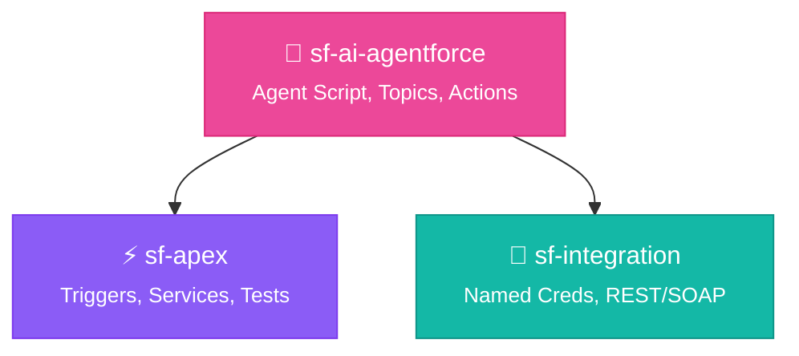
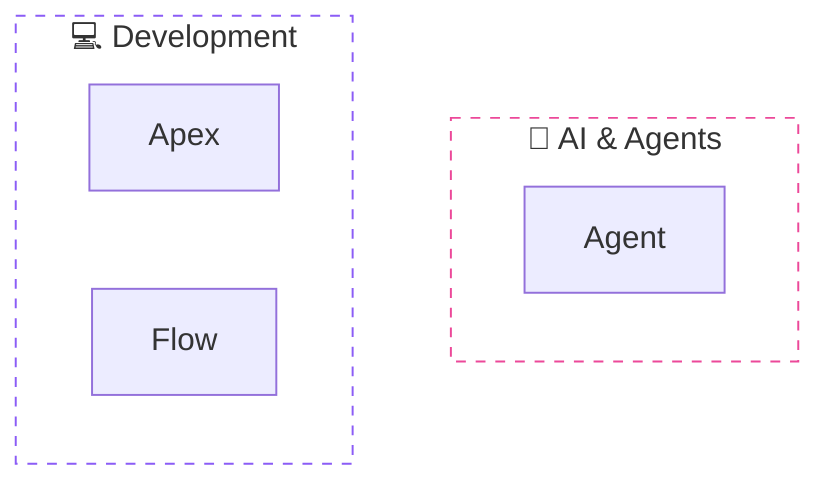
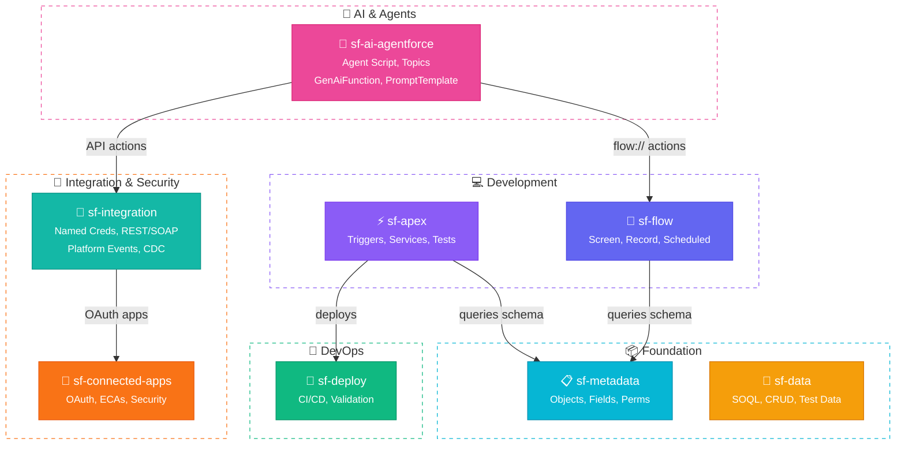

# sf-diagram Color Palette

Modern, accessibility-focused color palette matching the sf-skills README style.

## Primary Palette (Tailwind-inspired)

```
┌─────────────────────────────────────────────────────────────────────────────┐
│  COMPONENT                │  COLOR NAME    │  FILL HEX  │  STROKE HEX      │
├───────────────────────────┼────────────────┼────────────┼──────────────────┤
│  AI & Agents              │  Pink          │  #ec4899   │  #db2777         │
│  Integration/Security     │  Orange        │  #f97316   │  #ea580c         │
│  Integration (Alt)        │  Teal          │  #14b8a6   │  #0d9488         │
│  Diagrams/Documentation   │  Sky Blue      │  #0ea5e9   │  #0284c7         │
│  Apex/Development         │  Purple        │  #8b5cf6   │  #7c3aed         │
│  Flow/Automation          │  Indigo        │  #6366f1   │  #4f46e5         │
│  Metadata/Foundation      │  Cyan          │  #06b6d4   │  #0891b2         │
│  Data/Storage             │  Amber         │  #f59e0b   │  #d97706         │
│  Deploy/DevOps            │  Emerald       │  #10b981   │  #059669         │
│  Tooling/Utility          │  Slate         │  #64748b   │  #475569         │
└───────────────────────────┴────────────────┴────────────┴──────────────────┘
```

## Salesforce-Specific Colors

```
┌─────────────────────────────────────────────────────────────────────────────┐
│  SALESFORCE COMPONENT     │  FILL HEX      │  STROKE HEX │  TEXT COLOR     │
├───────────────────────────┼────────────────┼─────────────┼─────────────────┤
│  Salesforce Brand         │  #00A1E0       │  #032D60    │  #ffffff        │
│  Connected Apps/OAuth     │  #f97316       │  #ea580c    │  #ffffff        │
│  External Systems         │  #04844B       │  #032D60    │  #ffffff        │
│  Users/Actors             │  #9050E9       │  #7c3aed    │  #ffffff        │
│  Platform Events          │  #14b8a6       │  #0d9488    │  #ffffff        │
│  Named Credentials        │  #f97316       │  #ea580c    │  #ffffff        │
└───────────────────────────┴────────────────┴─────────────┴─────────────────┘
```

## Status Colors

```
┌─────────────────────────────────────────────────────────────────────────────┐
│  STATUS                   │  FILL HEX      │  STROKE HEX │  ICON           │
├───────────────────────────┼────────────────┼─────────────┼─────────────────┤
│  Success                  │  #10b981       │  #059669    │  ✅             │
│  Error/Failure            │  #ef4444       │  #dc2626    │  ❌             │
│  Warning                  │  #f59e0b       │  #d97706    │  ⚠️             │
│  Info/Neutral             │  #64748b       │  #475569    │  ℹ️             │
│  In Progress              │  #3b82f6       │  #2563eb    │  ⏳             │
└───────────────────────────┴────────────────┴─────────────┴─────────────────┘
```

---

## Mermaid Styling Approach

### Preferred: Individual Node Styling

Instead of using `%%{init}` blocks, use individual `style` declarations for better control and consistency:



### Subgraph Styling

Use transparent backgrounds with dashed borders:



---

## Node Label Patterns

### With Subtitle (Recommended)

```
["🔐 sf-connected-apps<br/><small>OAuth, ECAs, Security</small>"]
```

Renders as:
- Main title with icon
- Smaller subtitle with details

### Simple Label

```
[🤖 Service Agent]
```

### Database/Cylinder

```
[(💾 Database)]
```

---

## Complete Style Template

Copy this template for consistent diagrams:



---

## Icon Reference

| Category | Icon | Unicode | Usage |
|----------|------|---------|-------|
| AI/Agents | 🤖 | U+1F916 | Agentforce, AI features |
| Apex | ⚡ | U+26A1 | Code, triggers, services |
| Flow | 🔄 | U+1F504 | Automation, flows |
| Metadata | 📋 | U+1F4CB | Objects, fields |
| Data | 💾 | U+1F4BE | SOQL, records |
| Deploy | 🚀 | U+1F680 | CI/CD, deployment |
| Connected Apps | 🔐 | U+1F510 | OAuth, security |
| Integration | 🔗 | U+1F517 | Named Creds, callouts |
| Diagram | 📊 | U+1F4CA | Documentation |
| Tooling | 🛠️ | U+1F6E0 | Utilities |
| User | 👤 | U+1F464 | End users |
| Browser | 🌐 | U+1F310 | Web apps |
| Cloud | ☁️ | U+2601 | Salesforce platform |
| External | 🏭 | U+1F3ED | External systems |
| Database | 💾 | U+1F4BE | Data storage |

---

## Color Blind Accessibility

This palette maintains distinguishability for common color blindness:

| Condition | Our Approach |
|-----------|--------------|
| Protanopia | Pink vs Teal have different luminance |
| Deuteranopia | Orange vs Cyan are well separated |
| Tritanopia | Icons + text supplement colors |

### Key Principles

1. **Icons supplement colors** - Every node has an icon
2. **High contrast text** - White text on colored backgrounds
3. **Stroke differentiation** - Darker strokes add definition
4. **Dashed subgraphs** - Pattern, not just color

---

## Dark Mode Support

The style works on both light and dark backgrounds because:
- Nodes have solid fill colors
- White text provides contrast
- Strokes add definition
- Transparent subgraphs adapt to background

---

## References

- [Tailwind CSS Color Palette](https://tailwindcss.com/docs/colors)
- [Salesforce Lightning Design System](https://www.lightningdesignsystem.com/)
- [CloudSundial Diagrams](https://cloudsundial.com/diagrams-of-identity-flows-in-context)
