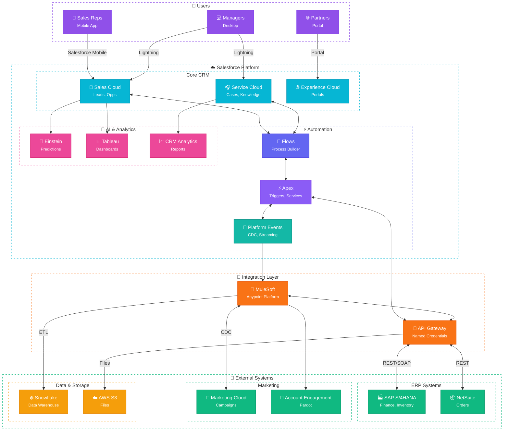
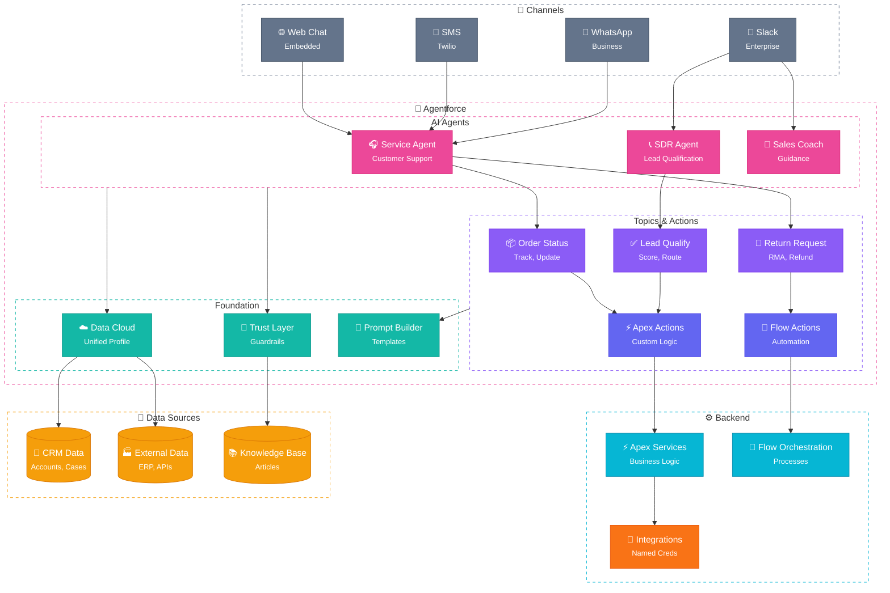

# System Landscape Diagram Template

Flowchart template for visualizing high-level Salesforce system architecture using the sf-skills standard styling.

## When to Use
- Architecture overview presentations
- Integration landscape documentation
- System inventory
- Stakeholder communication

## Mermaid Template - Sales Cloud Integration Landscape



## Mermaid Template - Agentforce Architecture



## ASCII Fallback Template

```
┌─────────────────────────────────────────────────────────────────────────────┐
│                              SYSTEM LANDSCAPE                               │
└─────────────────────────────────────────────────────────────────────────────┘

┌─────────────────────────────────────────────────────────────────────────────┐
│  👥 USERS                                                                   │
│  ┌───────────────┐  ┌───────────────┐  ┌───────────────┐                   │
│  │  Sales Reps   │  │   Managers    │  │   Partners    │                   │
│  │  (Mobile)     │  │  (Desktop)    │  │   (Portal)    │                   │
│  └───────┬───────┘  └───────┬───────┘  └───────┬───────┘                   │
└──────────│──────────────────│──────────────────│────────────────────────────┘
           │                  │                  │
           ▼                  ▼                  ▼
┌─────────────────────────────────────────────────────────────────────────────┐
│  ☁️ SALESFORCE PLATFORM                                                     │
│  ┌───────────────────────────────────────────────────────────────────────┐ │
│  │  CORE CRM                                                              │ │
│  │  ┌─────────────┐  ┌─────────────┐  ┌─────────────┐                    │ │
│  │  │ Sales Cloud │  │Service Cloud│  │ Experience  │                    │ │
│  │  │             │  │             │  │   Cloud     │                    │ │
│  │  └──────┬──────┘  └──────┬──────┘  └─────────────┘                    │ │
│  └─────────│────────────────│────────────────────────────────────────────┘ │
│            │                │                                               │
│  ┌─────────▼────────────────▼────────────────────────────────────────────┐ │
│  │  AUTOMATION                                                            │ │
│  │  ┌─────────────┐  ┌─────────────┐  ┌─────────────┐                    │ │
│  │  │    Flows    │──│    Apex     │──│  Platform   │                    │ │
│  │  │             │  │             │  │   Events    │                    │ │
│  │  └─────────────┘  └──────┬──────┘  └──────┬──────┘                    │ │
│  └──────────────────────────│────────────────│───────────────────────────┘ │
└─────────────────────────────│────────────────│──────────────────────────────┘
                              │                │
                              ▼                ▼
┌─────────────────────────────────────────────────────────────────────────────┐
│  🔄 INTEGRATION LAYER                                                       │
│  ┌─────────────────────────┐  ┌─────────────────────────┐                  │
│  │       MuleSoft          │  │      API Gateway        │                  │
│  │      Anypoint           │──│                         │                  │
│  └───────────┬─────────────┘  └───────────┬─────────────┘                  │
└──────────────│────────────────────────────│─────────────────────────────────┘
               │                            │
               ▼                            ▼
┌─────────────────────────────────────────────────────────────────────────────┐
│  🏢 EXTERNAL SYSTEMS                                                        │
│  ┌─────────────────────┐  ┌─────────────────────┐  ┌─────────────────────┐ │
│  │        ERP          │  │      Marketing      │  │    Data Storage     │ │
│  │  ┌───────┬───────┐  │  │  ┌───────┬───────┐  │  │  ┌───────┬───────┐  │ │
│  │  │  SAP  │NetSuit│  │  │  │  MC   │Pardot │  │  │  │Snowflk│  S3   │  │ │
│  │  └───────┴───────┘  │  │  └───────┴───────┘  │  │  └───────┴───────┘  │ │
│  └─────────────────────┘  └─────────────────────┘  └─────────────────────┘ │
└─────────────────────────────────────────────────────────────────────────────┘
```

## Component Types

| Category | Examples | Icon | Fill Color |
|----------|----------|------|------------|
| Users | Sales, Service, Partners | 👥 | `#9050E9` |
| Salesforce Clouds | Sales, Service, Marketing | ☁️ | `#06b6d4` |
| Automation | Flow, Apex, Events | ⚡ | `#6366f1` |
| AI/Analytics | Einstein, Tableau, CRM Analytics | 🤖 | `#ec4899` |
| Integration | MuleSoft, API Gateway | 🔗 | `#f97316` |
| External Systems | ERP, Marketing, Data | 🏢 | `#10b981` |
| Storage | Database, Data Lake, Files | 💾 | `#f59e0b` |

## Connection Types

| Pattern | Description | Arrow |
|---------|-------------|-------|
| Sync Request/Response | REST API call | `<-->` |
| Async (Event-based) | Platform Events, CDC | `-->` |
| Batch/ETL | Scheduled data load | `-->` (dashed) |
| Real-time streaming | CometD, Pub/Sub | `==>` |

## Customization Points

- Replace example systems with actual integrations
- Add or remove clouds based on implementation
- Include specific API names and versions
- Show data flow direction and volumes
